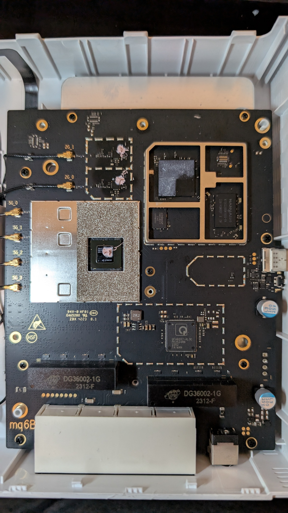
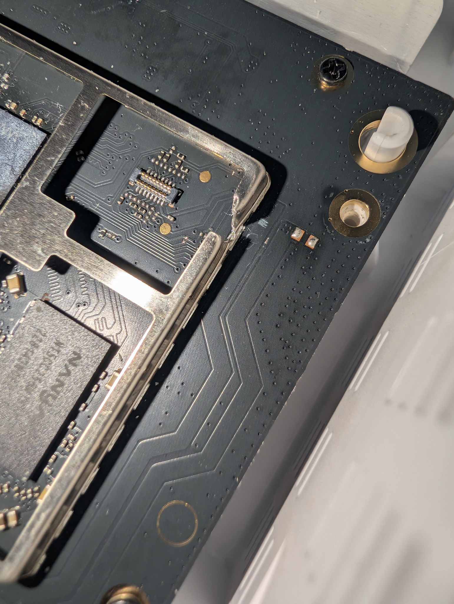

# ZTE T5400 — Hardware Inventory

Condensed BOM / component reference. Full evidence-grade version (confidence
tags, photo references, MMIO addresses, power/thermal detail) lives in the
project's internal hardware notes — this file is the summary for the port
docs / PR.

## Board photos




Component markings referenced in the BOM table below: [IPQ5018](photos/parts/IPQ5018.png),
[NT5CC256M16ER-EK](photos/parts/NT5CC256M16ER-EK.png),
[QCA8337-AL3C](photos/parts/QCA8337-AL3C.png),
[QCN9024 001](photos/parts/QCN9024-001.png),
[W25N02JWZEIF](photos/parts/W25N02JWZEIF.png).

## Summary

```text
Device                  ZTE T5400
Main SoC                Qualcomm IPQ5018
CPU                     2x ARM Cortex-A53 (shared 512 KiB L2)
Physical RAM            512 MiB DDR3L (Nanya NT5CC256M16ER-EK, x16, 96-ball BGA)
SPI-NAND                Winbond W25N02JWZEIF, 256 MiB (2 Gbit, 1.8 V, 2048+64B page, 128 KiB erase block)
External switch         Qualcomm Atheros QCA8337-AL3C rev.2 (runtime ID 0x1302)
Standalone Ethernet     internal IPQ5018 GEPHY
2.4 GHz WLAN            integrated IPQ5018 WLAN, 2x2 (antennas 2G_0/2G_1)
5 GHz WLAN              external Qualcomm QCN9024, 4x4 (antennas 5G_0..5G_3)
5 GHz PCI identity      17cb:1104, PCIe Gen2 x2
5 GHz Linux profile     ath11k QCN9074 hw1.0
RJ45 sockets            4 (Gigabit)
USB                     USB Type-C present (USB2 + USB3) — not supported by this port, deferred
Buttons                 RESET, WPS
Status LEDs             red, white
UART                    serial@78af000 / ttyMSM0 / 115200 8N1
```

## BOM table

| Ref | Category | Part | Notes |
|---|---|---|---|
| A | Main SoC | Qualcomm IPQ5018 001 | 2x Cortex-A53, integrated 2.4 GHz WLAN, internal GEPHY, PCIe/MDIO/QPIC/BLSP |
| B | DRAM | Nanya NT5CC256M16ER-EK | 512 MiB DDR3L, x16, up to 1866 Mb/s |
| C | SPI-NAND | Winbond W25N02JWZEIF | 256 MiB, firmware/persistent storage |
| D | Ethernet switch | QCA8337-AL3C rev.2 | 7-port Gigabit switch, CPU port 6 used |
| E | 2.4 GHz WLAN | integrated in IPQ5018 | 2x2 802.11ax, AHB/WCSS |
| F | 5 GHz WLAN | QCN9024 001 | 4x4 802.11ax, PCIe Gen2 x2, PCI 17cb:1104 |
| G | Standalone Eth PHY | integrated GEPHY | MDIO0 PHY7 → GMAC0 → RJ45 4 |
| H | Ethernet magnetics | marking `DG36002-1G` | exact mfr/pinout unknown |
| I | LEDs | discrete | white = GPIO1 (active-high), red = GPIO44 (active-high) |
| J | Buttons | discrete | RESET = GPIO32, WPS = GPIO38 (both active-low) |
| K | UART | IPQ5018 BLSP UART | GPIO20 RX / GPIO21 TX, 115200 8N1 1.8V |

USB-C hardware (Type-C CC controller etc.) is intentionally omitted here — see the note under "Block topology" below.

## Block topology

```text
Qualcomm IPQ5018
 ├─ 2x Cortex-A53
 ├─ 512 MiB external Nanya DDR3L
 ├─ 256 MiB Winbond W25N02JWZEIF SPI-NAND via QPIC (GPIO4-9)
 ├─ integrated 2.4 GHz 2x2 WLAN → 2G_0 / 2G_1
 ├─ internal GEPHY / GMAC0 → RJ45 4
 ├─ GMAC1 / UNIPHY0 / SGMII → QCA8337 CPU port 6 → RJ45 1/2/3
 ├─ PCIe Gen2 x2 → QCN9024 → 5G_0..5G_3
 └─ BLSP UART → GPIO20/21 console
```

A USB Type-C port is physically present on the board, but USB support is
**deferred** in this OpenWrt port (not part of the current device
submission) — see `08-openwrt-porting.md`. USB-C controller/GPIO wiring
details are intentionally left out of these public docs while the feature
is deferred; they still exist in the project's internal evidence if that
work resumes.

## Naming discipline — physical chip vs. software identity

```text
physical 5 GHz chip       QCN9024
PCI identity               17cb:1104
stock software family      qcn9000
Linux / ath11k profile     QCN9074 hw1.0
```

These four names describe different layers of the same radio and must not be
used interchangeably in docs/commit messages.

Device-unique secrets (real MAC addresses, raw calibration/ART contents) are
intentionally not reproduced in any of these docs.
