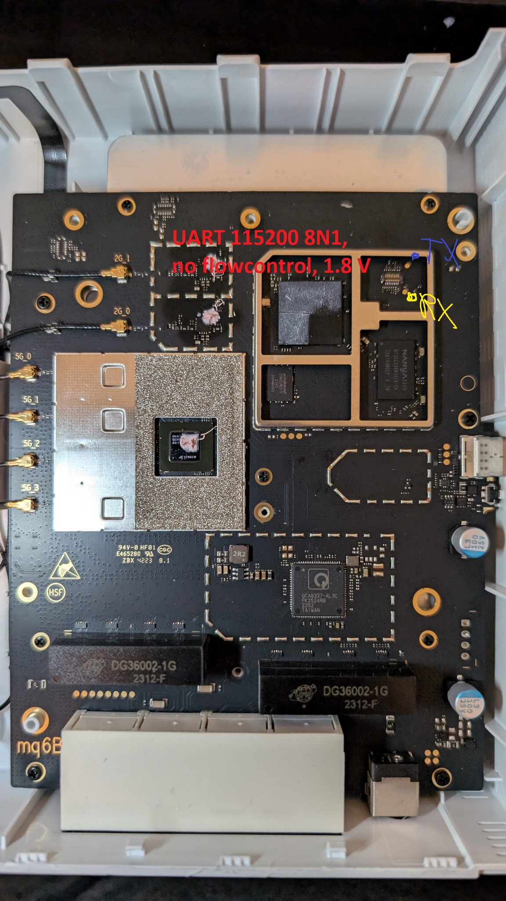
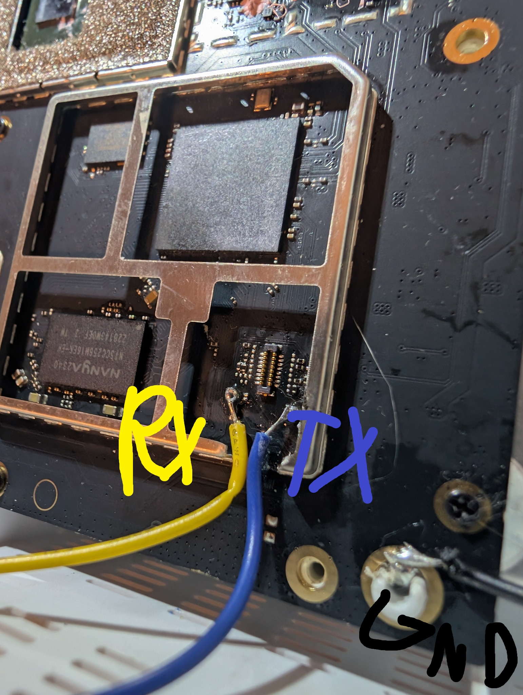

# ZTE T5400 — UART and Stock U-Boot

## UART wiring

```text
controller     serial@78af000 (MMIO 0x078af000, GIC SPI 107 level-high)
Linux console  ttyMSM0
baud           115200
data bits      8
parity         none
stop bits      1
flow control   none
logic level    1.8 V (confirmed)
router RX      GPIO20 (pull-up)
router TX      GPIO21 (bias disabled)
pinmux         blsp0_uart0 (DT label blsp1_uart1 — naming mismatch is expected)
```

Development wiring observed on the board:

```text
yellow wire   router RX / GPIO20
blue wire     router TX / GPIO21
black wire    ground
```


<p><em>Figure 1. ZTE T5400 main board with the UART pad location marked. UART: 115200 8N1, no flow control, 1.8 V logic.</em></p>


Connect a USB-UART adapter **crosswise**:

```text
USB-UART TX  -> router RX (yellow)
USB-UART RX  <- router TX (blue)
USB-UART GND -> router ground (black)
```


<p><em>Figure 2. Close-up of the UART pads with RX, TX and GND marked. Yellow wire: router RX; blue wire: router TX; black wire: GND.</em></p>

Terminal example:

```sh
picocom -b 115200 /dev/ttyUSB0
```

UART logic level is 1.8 V, confirmed by measurement.

Use a 1.8 V-compatible USB-UART adapter. Connect the adapter ground
to any confirmed board ground point; the UART does not require a
dedicated local ground pad.

Do not drive the router RX pad directly with a 3.3 V or 5 V UART signal.

## Stock U-Boot quick reference

```text
Bootloader              U-Boot 2016.01 (Dec 03 2022 - 17:36:22 +0800)
Vendor build tag        jenkins-Soft4_T5400G_TMO_CPE-4
Prompt                  IPQ5018#
Default command         bootipq
Autoboot delay          1 second (exact interrupt key not established — don't invent one)
Normal TFTP load addr   0x44000000
Stock U-Boot IP         192.168.0.1
Stock TFTP server IP    192.168.0.22
Stock netmask           255.255.255.0
U-Boot network port     eth0 / physical RJ45 port 4 (GEPHY path)
Stock FIT config used   config@mp03.1
Secure boot             disabled on captured unit
```

The captured unit has an invalid environment CRC (erased `0xff` APPSBLENV), so
it runs on **compiled defaults**, not a saved environment. `setenv` changes
only the in-memory environment. There is no need to run `saveenv` for the
installation or recovery flow; persistent U-Boot environment changes are not
part of the port.

### Bootloader storage on NAND

```text
mtd10  0:APPSBLENV  0x00480000  512 KiB   persistent env area (erased on captured unit)
mtd11  0:APPSBL     0x00500000  1.375 MiB primary U-Boot
mtd12  0:APPSBL_1   0x00660000  1.375 MiB second U-Boot slot
```

OpenWrt leaves all three untouched.

### Networking / TFTP

```text
setenv serverip <tftp-server-ip>
setenv ipaddr <router-ip>
```

These values only need to be changed transiently. You do not need to run
`saveenv`; a power cycle restores the compiled defaults.

Download to RAM:

```text
tftpboot 0x44000000 <filename>
```

`tftpput` exists and is read/export-only with respect to flash (exports RAM
to a TFTP server) — useful for pulling data off-device, never writes NAND by
itself.

### RAM boot (volatile — safe to experiment with)

```text
tftpboot 0x44000000 <openwrt-initramfs-image>
bootm 0x44000000
```

With an explicit FIT config, if needed:

```text
bootm 0x44000000#<fit-config>
```

No `saveenv`, NAND erase/write, UBI write, MIBIB modification, or bootconfig
change is required for this path. This is also the recovery/rescue entry
point (see `07-install-recovery.md`).

### Persistent OpenWrt boot path (unchanged stock bootloader policy)

```text
stock U-Boot bootipq
  -> MIBIB rootfs / mtd17
  -> OpenWrt UBI volume 0: kernel  (FIT config@mp03.1)
  -> Linux
  -> OpenWrt UBI volume 1: rootfs      -> /dev/ubiblock0_1 -> /rom (SquashFS ro)
  -> OpenWrt UBI volume 2: rootfs_data -> /overlay (UBIFS rw)
```

Stock U-Boot reads and boots the Linux-written OpenWrt UBI/FIT through its
unmodified compiled default `bootcmd=bootipq`. No persistent U-Boot environment,
MIBIB, or BOOTCONFIG changes are needed — validated across first install,
`sysupgrade -n`, config-preserving `sysupgrade`, and true cold power-cycles.

`/dev/ubiblock0_1` means UBI device 0, volume 1 (`rootfs`) inside `mtd17`; it
does **not** refer to the separate `rootfs_1` MTD partition (`mtd18`).

### Stock UBI volumes visible to U-Boot (for comparison)

```text
0  kernel        FIT kernel + FDT
1  wifi_fw       vendor WLAN firmware
2  bt_fw         Bluetooth firmware
3  ubi_rootfs    stock SquashFS rootfs
4  web           web/UI content
```

U-Boot only needs the `rootfs`/`kernel` boot boundary it already understands;
`wifi_fw`, `bt_fw`, `ubi_rootfs`, `web` are irrelevant to the final OpenWrt
system.

### Useful read-only inspection commands (stock U-Boot, before first boot)

```text
smeminfo
ubi info
ubi info l
ubi check kernel
ubi check rootfs
ubi check rootfs_data
ubi read 0x44000000 kernel
md.b 0x44000000 4          # expect FIT magic d0 0d fe ed
```

Note: `ubi part rootfs` is **not** the canonical T5400 discovery path — the
compiled stock environment has no `mtdids`/`mtdparts` mapping for it. An
error there does not by itself mean the UBI is invalid if `smeminfo` already
attached it. Don't "fix" this by writing a persistent U-Boot environment.
